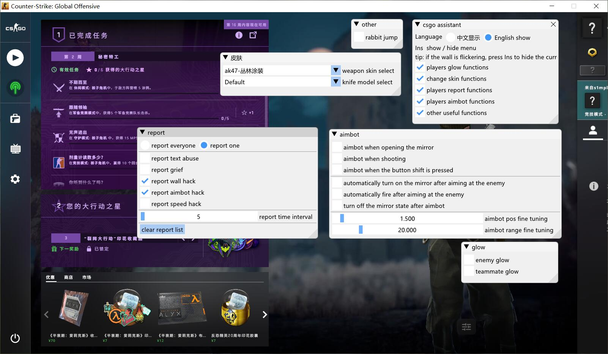

# csgo_cheats
 
这是一个根据Osiris改进而来的CSGO游戏辅助,去除了很多不需要的功能，加入了自己的想法

# 效果图
<h1 align="center">
	
	
	
	
</h1>

## 视频观看[优酷视频](https://v.youku.com/v_show/id_XNDU5Mzk2Njc5Mg==.html)

## 尝试编译
笔者用的编译器是VS2017版，Release版本 X84版本 ISO C++最新草案标准(/std:c++latest) DLL

## 字体问题
为了正常中文显示，所以需要一个能显示中文的字体msyh.ttc，你们的C盘里面应该有，没有的话就去百度下载一个，或者到这里下载[msyh](http://font.chinaz.com/161111131720.htm)，下载到了就放到C盘根目录，再次注入就能正常显示中文了

## 注入器问题
随便上百度下载一个DLL注入器，这样子不需要辅助了还能卸载

## 功能
* **人物辉光**仅仅实现了不同阵营人物的辉光，没有太多的设置
* **武器换肤**可以将武器皮肤应用到任意一把武器上，比如能够把龙狙皮肤应用到M4A1上或者手枪上，但是没有加入更换匕首和手套的功能
* **玩家举报**不仅可以举报全部玩家，而已还能针对一个玩家进行循环举报，这招就叫贼喊捉贼，先声夺人
* **人物自瞄**有开镜自瞄，开启自瞄，静步自瞄而已，没有加入旋转陀螺的功能
* **其它功能**这个没想到还需要什么功能，就写了一个连跳而已

